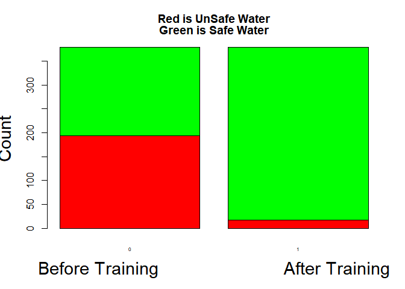
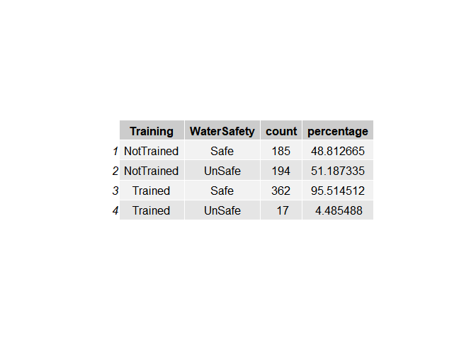
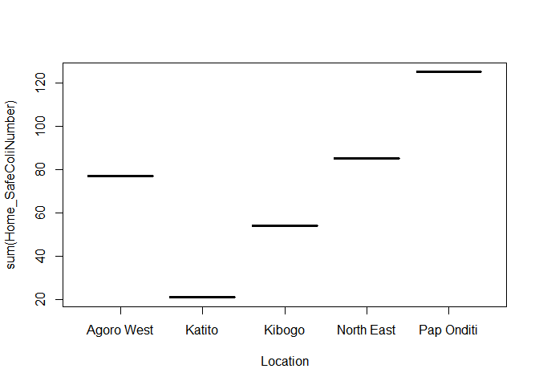
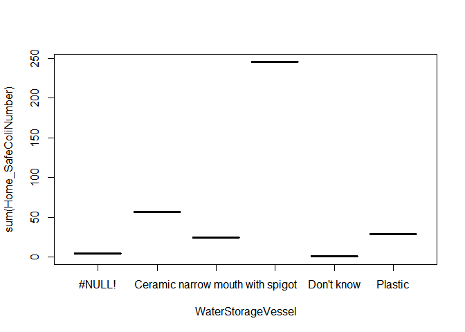

#### Set up

    suppressWarnings(library(dplyr))
    suppressWarnings(library(ggplot2))
    suppressWarnings(library(tidyr))
    #suppressWarnings(library(ggmap))
    suppressWarnings(library(statsr))
    #suppressWarnings(library(pander))
    #suppressWarnings(library(pwr))
    suppressWarnings(library(gridExtra))
    suppressWarnings(library(foreign))
    #suppressWarnings(library(xlsx))
    #suppressWarnings(library(rJava))
    source('http://bit.ly/dasi_inference')

### Load data from working directory

    dfDissertation1<-tbl_df(read.csv("Dissertation Full Data from the Questionaire 9-26-17_Katy.csv"))

### Work with data frame

    dfDiss2<-rename(dfDissertation1,BelieveYourWaterSafe=Q5f..do.you.think.water.is.safe.to.drink..,Home_PetriTest=Hvpetrifrest, Raw_PetriTest=Wspetriftest,Home_ColiLevel=HvColiresult..Home.vessel.drinking.water.test.result.,Raw_ColiLevel=Wscoliresult..raw.water.source.test.result.,HomeChlorRes=Hvchloresidtest,HowLongTreating=Q5a..how.long.have.you.been.using.the.method.,WaterStorageVessel=Q5d..type.of.vessel.,TreatmentMethod=Q5i..method.of.treatment.,DoYouTreatYourwater=Q4..do.you.treat.your.water..)

    dfDiss3<-select(dfDiss2,DoYouTreatYourwater,TreatmentMethod,HowLongTreating,BelieveYourWaterSafe,HomeChlorRes,Home_PetriTest,Home_ColiLevel,Raw_PetriTest,Raw_ColiLevel,WaterStorageVessel,Respondent,Location,Longitude)

    sapply(dfDiss3,n_distinct)

    ##  DoYouTreatYourwater      TreatmentMethod      HowLongTreating 
    ##                    2                    4                   34 
    ## BelieveYourWaterSafe         HomeChlorRes       Home_PetriTest 
    ##                    3                   18                   21 
    ##       Home_ColiLevel        Raw_PetriTest        Raw_ColiLevel 
    ##                    3                   28                    2 
    ##   WaterStorageVessel           Respondent             Location 
    ##                    6                  346                    5 
    ##            Longitude 
    ##                  331

### Modify variables so that safe ("yes"/or 1) water is when E.Coli test=("none" or "bacteria but no E.Coli") and to unsafe ("no"/or 0) when test=(E.Coli present)

    df4<-mutate(dfDiss3,Home_SafeColiRating=ifelse(Home_ColiLevel=="Safe water"|Home_ColiLevel=="Presence of environmental bacteria but no E. coli","Yes","No"))

    df5<-mutate(df4,Raw_SafeColiRating=ifelse(Raw_ColiLevel=="Safe water"|Raw_ColiLevel=="Presence of environmental bacteria but no E. coli","Yes","No"))

##### Change Yes/No to 1 or 0 for calculating percentage of safe water in treated vrs raw. removed those who say they don't treat their water but also stated which treatment method they used (note very few were in this category)

    df6<-mutate(df5,Raw_SafeColiNumber=ifelse(Raw_SafeColiRating=="Yes",1,0),Home_SafeColiNumber=ifelse(Home_SafeColiRating=="Yes",1,0))
    PercSafeRaw<-(sum(df6$Raw_SafeColiNumber)/nrow(df6))*100
    PercSafeHome<-(sum(df6$Home_SafeColiNumber)/nrow(df6))*100

### Percentage of raw water that is safe from Aug 2017 survey/tests

    PercSafeRaw

    ## [1] 24.05063

### Percentage of Home Water that is safe from Aug 2017 survey/tests

    PercSafeHome

    ## [1] 95.6962

### Number of respondents that say they don't treat their water - removed those who say they don't treat their water but also stated which treatment method they used (note 16 were in this category)

     df6b<-filter(df6,df6$DoYouTreatYourwater=="Yes")
     ##Percentage of respondents who say they treat their water
     nrow(df6)-nrow(df6b)

    ## [1] 16

     df7<-select(df6b,TreatmentMethod,HowLongTreating,BelieveYourWaterSafe,HomeChlorRes,Home_PetriTest,Home_SafeColiRating,Home_SafeColiNumber,Raw_SafeColiRating,Raw_SafeColiNumber,Raw_ColiLevel,WaterStorageVessel,Respondent,Location,Longitude)

##### Separate who drank raw water before training/help

    df8<-mutate(df7,PreStudyTreatment=ifelse(HowLongTreating>=66,"Yes","No"))
    df8<-select(df8,TreatmentMethod,PreStudyTreatment,BelieveYourWaterSafe,HomeChlorRes,Home_PetriTest,Home_SafeColiRating,Home_SafeColiNumber,Raw_SafeColiRating,Raw_SafeColiNumber,Raw_ColiLevel,WaterStorageVessel,Respondent,Location,Longitude)

    df8b<-filter(df8,PreStudyTreatment=="Yes")
    df8c<-filter(df8,PreStudyTreatment=="No")
    #nrow(df8)#nrow(df8b)#nrow(df8c)#nrow(df8b)+nrow(df8c)
    PercentageTreatingPreStudy<-nrow(df8b)/nrow(df8)
    PercentageNoTreatmentPreStudy<-nrow(df8c)/nrow(df8)

### Percentage of respondants that treated water before training/help

    PercentageTreatingPreStudy

    ## [1] 0.292876

### Percentage of responants that did not treat their water before training/help

    PercentageNoTreatmentPreStudy

    ## [1] 0.707124

### Those that did not treat before the training/help was provided (before Feb 2012) are considered to have consumed water of "raw" water quality before training/help was given. Therefore the quality of the "raw" water from the 2017 study was used in the database.

### Those who treated their water before the study (before Feb 2012) are considered to have consumed water of quality similar to that found in the treated water during the August 2017 study.

    df9<-mutate(df8,BeforeTrainingWaterQuality=ifelse(PreStudyTreatment=="Yes",Home_SafeColiNumber,Raw_SafeColiNumber))
    df9<-select(df9,TreatmentMethod,PreStudyTreatment,BelieveYourWaterSafe,BeforeTrainingWaterQuality,HomeChlorRes,Home_PetriTest,Home_SafeColiRating,Home_SafeColiNumber,Raw_SafeColiRating,Raw_SafeColiNumber,Raw_ColiLevel,WaterStorageVessel,Respondent,Location,Longitude)

##### Do Calculations to compare before training/help safe water numbers with after training/help safe water numbers

    PercentSafeWaterBefore<-100*(sum(df9$BeforeTrainingWaterQuality)/nrow(df9))
    PercentSafeWaterAfter<-100*(sum(df9$Home_SafeColiNumber/nrow(df9)))

### Percentage of Safe Water in homes before training/help

    PercentSafeWaterBefore

    ## [1] 48.81266

### Percentage of Safe Water in homes after training/help

    PercentSafeWaterAfter

    ## [1] 95.51451

### Make a new database where water safety is compared to training level and run a statistical analysis showing training/help's influence on water safety. Note that the p-value is effectively zero thus indicating overwhelming evidence that the training provided in this study has a positive influence on water safety.

    dfbefore<-select(df9,BeforeTrainingWaterQuality,Location,WaterStorageVessel,TreatmentMethod,BelieveYourWaterSafe)
    dfbefore<-rename(dfbefore,WaterSafety=BeforeTrainingWaterQuality)
    dfbefore<-mutate(dfbefore,Training=0)
    dfafter<-select(df9,Home_SafeColiNumber,Location)
    dfafter<-rename(dfafter,WaterSafety=Home_SafeColiNumber)
    dfafter<-mutate(dfafter,Training=1)
    dftotal<-bind_rows(dfbefore,dfafter)
    dft<-select(dftotal,WaterSafety,Training)
    barplot(table(dft),col = c("red","green"), ylab = "Count", xlab = paste("Before Training","                        ","After Training"),cex.names = .5,
            main = c("Red is UnSafe Water","Green is Safe Water"),cex.lab =1.8)

    #barplot(table(dft),col = c("red","green"), ylab = "Count", xlab = paste("Before Training","                        ","After Training"),main = c("Red is UnSafe Water","Green is Safe Water"),cex.lab =2,legend("bottom",c("Safe Water","Dirty Water"),fill = c("green","red"),cex = 1.5)))
    fit<-lm(WaterSafety~Training,data = dft)
    #fit2<-lm(WaterSafety~Training,data = dftotal)
    summary(fit)

    ## 
    ## Call:
    ## lm(formula = WaterSafety ~ Training, data = dft)
    ## 
    ## Residuals:
    ##      Min       1Q   Median       3Q      Max 
    ## -0.95515 -0.48813  0.04485  0.04485  0.51187 
    ## 
    ## Coefficients:
    ##             Estimate Std. Error t value Pr(>|t|)    
    ## (Intercept)  0.48813    0.01968   24.81   <2e-16 ***
    ## Training     0.46702    0.02783   16.78   <2e-16 ***
    ## ---
    ## Signif. codes:  0 '***' 0.001 '**' 0.01 '*' 0.05 '.' 0.1 ' ' 1
    ## 
    ## Residual standard error: 0.3831 on 756 degrees of freedom
    ## Multiple R-squared:  0.2714, Adjusted R-squared:  0.2705 
    ## F-statistic: 281.7 on 1 and 756 DF,  p-value: < 2.2e-16

    #summary(fit2)
    t.test(WaterSafety~Training,data = dft)

    ## 
    ##  Welch Two Sample t-test
    ## 
    ## data:  WaterSafety by Training
    ## t = -16.783, df = 503.93, p-value < 2.2e-16
    ## alternative hypothesis: true difference in means is not equal to 0
    ## 95 percent confidence interval:
    ##  -0.5216898 -0.4123472
    ## sample estimates:
    ## mean in group 0 mean in group 1 
    ##       0.4881266       0.9551451

    #t.test(WaterSafety~Training,data = dftotal) 
    #Note that fit and t.test are identical for both dft and dftotal - as expected
    #inference(y=WaterSafety,x=Training,data=dft,statistic="mean",type="ht",null=0,alternative="twosided",method="theoretical")
    #inference(y=WaterSafety,x=Training,data=dft,statistic="mean",type="ci",method="theoretical")

RQ1
---

### Is there an association between the change in diarrhea morbidity in Lower Nyakach, Kenya, and the novel evidence-based microbiology intervention? Due to medical privacy issues - there is no practical way to directly correlate evidence-based microbiology intervention (with it's associated training) to lower diarrhea morbidity, this study uses the reasonable assumption that consuming safe water vrs contaminated water is associated to lower diarrhea morbidity.

#### Create XLSX,SPSS&txt file from dft

    #write.foreign(dft, "c:/Users/gary/Dropbox/Rstudio/R data files/Blodgett/Blodgett/dft.txt", "c:/Users/gary/Dropbox/Rstudio/R data files/Blodgett/Blodgett/dft.sps",   package="SPSS")

    #write.xlsx(dft, "c:/Users/gary/Dropbox/Rstudio/R data files/Blodgett/Blodgett/dft.xlsx")

RQ2
---

### Is there an association in WHO risk of waterborne disease and the possession of a safe water vessel.

#### Create XLSX,SPSS&txt file from dft2

    dft2b<-select(dftotal,WaterSafety,WaterStorageVessel)
    dft2<-filter(dft2b,WaterStorageVessel=="Ceramic wide mouth"|WaterStorageVessel=="Ceramic narrow mouth"|WaterStorageVessel=="Ceramic narrow mouth with spigot")
    dft2$WaterStorageVessel<-factor(dft2$WaterStorageVessel)
    dft2c<-group_by(dft2,WaterStorageVessel)
    summarise(dft2c,mean(WaterSafety))

    ## # A tibble: 3 x 2
    ##   WaterStorageVessel               `mean(WaterSafety)`
    ##   <fct>                                          <dbl>
    ## 1 Ceramic narrow mouth                           0.672
    ## 2 Ceramic narrow mouth with spigot               0.577
    ## 3 Ceramic wide mouth                             0.461

    dft2<-mutate(dft2,vessel=(ifelse(WaterStorageVessel=="Ceramic wide mouth",0,1)))
    fit<-lm(WaterSafety~vessel,dft2)
    summary(fit)

    ## 
    ## Call:
    ## lm(formula = WaterSafety ~ vessel, data = dft2)
    ## 
    ## Residuals:
    ##     Min      1Q  Median      3Q     Max 
    ## -0.6429 -0.4609  0.3571  0.5391  0.5391 
    ## 
    ## Coefficients:
    ##             Estimate Std. Error t value Pr(>|t|)    
    ## (Intercept)  0.46094    0.03095  14.892  < 2e-16 ***
    ## vessel       0.18192    0.06227   2.921  0.00372 ** 
    ## ---
    ## Signif. codes:  0 '***' 0.001 '**' 0.01 '*' 0.05 '.' 0.1 ' ' 1
    ## 
    ## Residual standard error: 0.4952 on 338 degrees of freedom
    ## Multiple R-squared:  0.02463,    Adjusted R-squared:  0.02174 
    ## F-statistic: 8.535 on 1 and 338 DF,  p-value: 0.003719

    dft2spigot<-filter(dft2b,WaterStorageVessel=="Ceramic narrow mouth"|WaterStorageVessel=="Ceramic narrow mouth with spigot")
    dft2spigot<-mutate(dft2spigot,vessel=(ifelse(WaterStorageVessel=="Ceramic narrow mouth",0,1)))
    fit<-lm(WaterSafety~vessel,dft2spigot)
    summary(fit)

    ## 
    ## Call:
    ## lm(formula = WaterSafety ~ vessel, data = dft2spigot)
    ## 
    ## Residuals:
    ##     Min      1Q  Median      3Q     Max 
    ## -0.6724 -0.5769  0.3276  0.3276  0.4231 
    ## 
    ## Coefficients:
    ##             Estimate Std. Error t value Pr(>|t|)    
    ## (Intercept)  0.67241    0.06341  10.605   <2e-16 ***
    ## vessel      -0.09549    0.11397  -0.838    0.405    
    ## ---
    ## Signif. codes:  0 '***' 0.001 '**' 0.01 '*' 0.05 '.' 0.1 ' ' 1
    ## 
    ## Residual standard error: 0.4829 on 82 degrees of freedom
    ## Multiple R-squared:  0.008488,   Adjusted R-squared:  -0.003604 
    ## F-statistic: 0.702 on 1 and 82 DF,  p-value: 0.4046

    #t.test(WaterSafety~vessel,dft2spigot)

    #write.foreign(dft2wide, "c:/Users/gary/Dropbox/Rstudio/R data files/Blodgett/Blodgett/dft2wide.txt", "c:/Users/gary/Dropbox/Rstudio/R data files/Blodgett/Blodgett/dftwide.sps",   package="SPSS")

    ##write.xlsx(dft2spigot, "c:/Users/gary/Dropbox/Rstudio/R data files/Blodgett/Blodgett/dft2spigot.xlsx")

RQ3
---

### Is there a difference in WHO risk between solar pasteurization users and chlorine bleach users?

#### Create XLSX,SPSS&txt file from dft3

    dft3b<-select(dftotal,WaterSafety,TreatmentMethod)
    dft3b<-na.omit(dft3b)
    dft3b<-filter(dft3b,TreatmentMethod=="Add bleach/chlorine"|TreatmentMethod=="Boil")
    dft3b$TreatmentMethod<-factor(dft3b$TreatmentMethod)

    dft3c<-group_by(dft3b,TreatmentMethod)
    summarise(dft3c,mean(WaterSafety))

    ## # A tibble: 2 x 2
    ##   TreatmentMethod     `mean(WaterSafety)`
    ##   <fct>                             <dbl>
    ## 1 Add bleach/chlorine               0.497
    ## 2 Boil                              0.333

    dft3<-mutate(dft3b,Method=(ifelse(TreatmentMethod=="Boil",0,1)))
    fit<-lm(WaterSafety~Method,dft3)
    summary(fit)

    ## 
    ## Call:
    ## lm(formula = WaterSafety ~ Method, data = dft3)
    ## 
    ## Residuals:
    ##     Min      1Q  Median      3Q     Max 
    ## -0.4972 -0.4972 -0.3333  0.5028  0.6667 
    ## 
    ## Coefficients:
    ##             Estimate Std. Error t value Pr(>|t|)  
    ## (Intercept)   0.3333     0.1292   2.581   0.0102 *
    ## Method        0.1639     0.1318   1.244   0.2144  
    ## ---
    ## Signif. codes:  0 '***' 0.001 '**' 0.01 '*' 0.05 '.' 0.1 ' ' 1
    ## 
    ## Residual standard error: 0.5002 on 375 degrees of freedom
    ## Multiple R-squared:  0.004107,   Adjusted R-squared:  0.001451 
    ## F-statistic: 1.546 on 1 and 375 DF,  p-value: 0.2144

    #write.xlsx(dft3, "c:/Users/gary/Dropbox/Rstudio/R data files/Blodgett/Blodgett/dft3.xlsx")

    dft5<-dft
    dft5<-mutate(dft5,WaterSafety=ifelse(WaterSafety==0,"UnSafe","Safe"))
    dft5<-group_by(dft5,WaterSafety,Training)
    bb<-summarise(dft5,count=n())
    bb2<-bb
    bb2<-group_by(bb2,Training)
    bb2<-summarise(bb2,sum(count))
    bbf<-mutate(bb,Training=ifelse(Training==0,"NotTrained","Trained"))
    bbg<-mutate(bbf,percentage=ifelse(WaterSafety=="Safe",count*100/(as.numeric(bb2[2,2])),count*100/(as.numeric(bb2[2,2]))))
    bbg<-arrange(bbg,Training)
    bbg<-select(bbg,Training,WaterSafety,count,percentage)
    grid.table(bbg)

Appendix - explains summary statistical report
----------------------------------------------

### Look at summary functions as follows:

#### The model above is achieved by using the lm() function in R and the output is called using the summary() function on the model and briefly explain each component of the model output:

#### Formula Call

##### As you can see, the first item shown in the output is the formula R used to fit the data. Note the simplicity in the syntax: the formula just needs the predictor (x) and the target/response variable (y), together with the data being used.

#### Residuals

##### Residuals are essentially the difference between the actual observed response values and the response values that the model predicted. The Residuals section of the model output breaks it down into 5 summary points. When assessing how well the model fit the data, you should look for a symmetrical distribution across these points on the mean value zero. We could take this further consider plotting the residuals to see whether this normally distributed, etc - see plots below.

#### Coefficients

##### The next section in the model output talks about the coefficients of the model. Theoretically, in simple linear regression, the coefficients are two unknown constants that represent the intercept and slope terms in the linear model. If we wanted to predict y given x, we would get a training set and produce estimates of the coefficients to then use it in the model formula. Ultimately, the analyst wants to find an intercept and a slope such that the resulting fitted line is as close as possible to data points in our data set.

#### Coefficient - Estimate

##### The coefficient Estimate contains two rows; the first one is the intercept. The second row in the Coefficients is the slope.

#### Coefficient - Standard Error

##### The coefficient Standard Error measures the average amount that the coefficient estimates vary from the actual average value of our response variable. We would ideally want a lower number relative to its coefficients. In our example, we have previously determined that for every 1 increase in x - y will increase 0.46702 The Standard Error can be used to compute an estimate of the expected difference in case we ran the model again and again. In other words, we can say that y can vary by 0.02783. The Standard Errors can also be used to compute confidence intervals and to statistically test the hypothesis of the existence of a relationship between speed and distance required to stop.

#### Coefficient - t value

##### The coefficient t-value is a measure of how many standard deviations our coefficient estimate is - we want it to be far away from zero as this would indicate we could reject the null hypothesis - that is, we could declare a relationship between x and y exist. In our example, the t-statistic values are relatively far away from zero and are large relative to the standard error, which could indicate a relationship exists. In general, t-values are also used to compute p-values.

#### Coefficient - Pr(&gt;|t|)

##### The Pr(&gt;|t|) acronym found in the model output relates to the probability of observing any value equal or larger than |t|. A small p-value indicates that it is unlikely we will observe a relationship between the predictor (x) and response (y) variables due to chance. Typically, a p-value of 5% or less is a good cut-off point. In our model example, the p-values are very close to zero. Note the signif. Codes associated to each estimate. Three stars (or asterisks) represent a highly significant p-value. Consequently, a small p-value for the intercept and the slope indicates that we can reject the null hypothesis which allows us to conclude that there is a relationship between Training and Safe Water.

#### Residual Standard Error

##### Residual Standard Error is measure of the quality of a linear regression fit. Theoretically, every linear model is assumed to contain an error term E. Due to the presence of this error term, we are not capable of perfectly predicting our response variable (y) from the predictor (x). The Residual Standard Error is the average amount that the response (y) will deviate from the true regression line. In our example, the actual y value can deviate from the regression line by approximately 0.3831, on average. In other words, given that the mean x value of 0.48813 and that the Residual Standard Error is 0.3831, we can say that the percentage error is (any prediction would still be off by) 78.48% - Note that without dimension, this doesn't appear to mean much. It is also worth noting that the Residual Standard Error was calculated with 756 degrees of freedom. Simplistically, degrees of freedom are the number of data points that went into the estimation of the parameters used after taking into account these parameters (restriction).

#### Multiple R-squared, Adjusted R-squared

##### The R-squared statistic (R^2) provides a measure of how well the model is fitting the actual data. It takes the form of a proportion of variance. The (R^2)is a measure of the linear relationship between our predictor variable (x) and our response / target variable (y). It always lies between 0 and 1 (i.e.: a number near 0 represents a regression that does not explain the variance in the response variable well and a number close to 1 does explain the observed variance in the response variable). In our example, the (R^2) we get is 0.2714. Or roughly 27% of the variance found in the response variable (y) can be explained by the predictor variable (x1). It should be noted that .27% indicates that x is a predictor of y. That why we get a relatively strong (R^2). Nevertheless, it's hard to define what level of (R^2)is appropriate to claim the model fits well. Essentially, it will vary with the application and the domain studied. A side note: In multiple regression settings, the (R^2)will always increase as more variables are included in the model. That is why the adjusted (R^2) is the preferred measure as it adjusts for the number of variables considered.

#### F-Statistic

##### F-statistic is a good indicator of whether there is a relationship between our predictor and the response variables. The further the F-statistic is from 1 the better it is. However, how much larger the F-statistic needs to be depends on both the number of data points and the number of predictors. Generally, when the number of data points is large, an F-statistic that is only a little bit larger than 1 is already sufficient to reject the null hypothesis (H0 : There is no relationship between x1 and y). The reverse is true as if the number of data points is small, a large F-statistic is required to be able to ascertain that there may be a relationship between predictor and response variables. In our example the F-statistic is 1990 which is relatively larger than 1 given the size of our data.

### Graphs TreatmentMethod 3, PreStudyTreatment 2, BelieveYourWaterSafe 3, BeforeTrainingWaterQuality 2,

Home\_SafeColiRating 2, Home\_SafeColiNumber 2, Raw\_SafeColiRating 2, Raw\_SafeColiNumber 2, Raw\_ColiLevel 2,
---------------------------------------------------------------------------------------------------------------

WaterStorageVessel 6, Location 5
--------------------------------

    cc<-sapply(df9,n_distinct)
    ##Remove variables with more than 4 distinct values 
    ccc<-cc[!cc %in% 4:400]
    ccc

    ##            TreatmentMethod          PreStudyTreatment 
    ##                          3                          2 
    ##       BelieveYourWaterSafe BeforeTrainingWaterQuality 
    ##                          3                          2 
    ##        Home_SafeColiRating        Home_SafeColiNumber 
    ##                          2                          2 
    ##         Raw_SafeColiRating         Raw_SafeColiNumber 
    ##                          2                          2 
    ##              Raw_ColiLevel 
    ##                          2

    group1<-group_by(df9,Location)
    plot1<-summarise(group1,sum(Home_SafeColiNumber))
    plot(plot1)

    group2<-group_by(df9,WaterStorageVessel)
    plot2<-summarise(group2,sum(Home_SafeColiNumber))
    plot(plot2)

    (sum(df9$Home_SafeColiNumber/nrow(df9)))

    ## [1] 0.9551451
